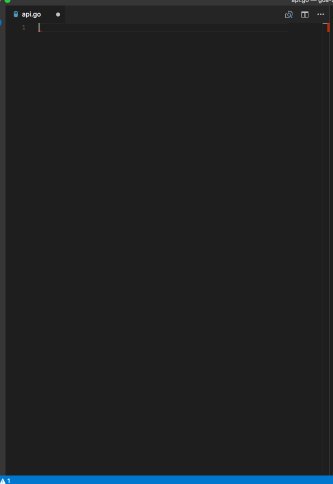

# goa Snippets for VS Code

**This snippets are under development.**

This extension for Visual Studio Code adds snippets for goa DSL.



See the [CHANGELOG](CHANGELOG.md) for the latest changes.

## Supported DSL

* API
* APIKeySecurity
* BasicAuthSecurity
* Resource
* Action
* MediaType
* Contact
* License
* Routing
* Attribute
* Param
* Member
* Header

## Snippets

```go
goa-import
goa-API
goa-APIKeySecurity
goa-BasicAuthSecurity
goa-Resource
goa-Action
goa-MediaType
goa-Routing-CONNECT
goa-Routing-DELETE
goa-Routing-GET
goa-Routing-HEAD
goa-Routing-OPTIONS
goa-Routing-PATCH
goa-Routing-POST
goa-Routing-PUT
goa-Routing-TRACE
goa-Attribute
goa-Attribute-dsl
goa-Attribute-dataType
goa-Attribute-dataType-dsl
goa-Attribute-dataType-description
goa-Attribute-dataType-description-dsl
goa-Param
goa-Param-dsl
goa-Param-dataType
goa-Param-dataType-dsl
goa-Param-dataType-description
goa-Param-dataType-description-dsl
goa-Member
goa-Member-dsl
goa-Member-dataType
goa-Member-dataType-dsl
goa-Member-dataType-description
goa-Member-dataType-description-dsl
goa-Header
goa-Header-dsl
goa-Header-dataType
goa-Header-dataType-dsl
goa-Header-dataType-description
goa-Header-dataType-description-dsl
```
